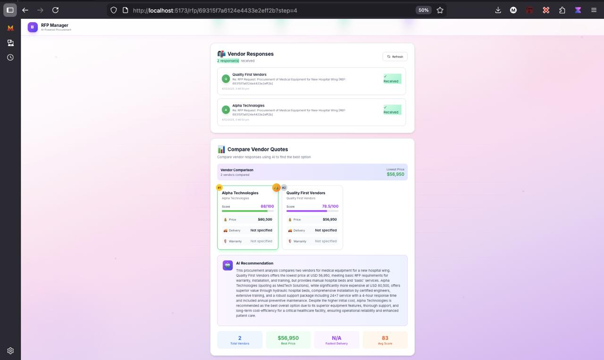

# 🎯 AI-Powered RFP Management System

> An intelligent, single-user web application that revolutionizes Request for Proposal (RFP) workflows through AI-powered automation, vendor management, and smart quote comparison.

<div align="center">


[View Demo](#-quick-start) • [Documentation](#-documentation) • [Features](#-key-features) • [API Docs](#-api-documentation)

</div>

---

## 📋 Table of Contents

- [✨ Overview](#-overview)
- [🎯 Key Features](#-key-features)
- [📸 Screenshots](#-screenshots)
- [🛠️ Tech Stack](#-tech-stack)
- [🚀 Quick Start](#-quick-start)
- [📖 Installation Guide](#-installation-guide)
- [🏗️ Project Structure](#-project-structure)
- [📚 API Documentation](#-api-documentation)
- [🔧 Configuration](#-configuration)
- [💡 Key Decisions & Assumptions](#-key-decisions--assumptions)
- [🤖 AI Integration](#-ai-integration)
- [🎓 Usage Guide](#-usage-guide)
- [📝 License](#-license)
- [👥 Contributing](#-contributing)

---

## 🚀 Project Setup

### Prerequisites

- **Node.js**: v18.0.0 or higher
- **npm**: v9.0.0 or higher (comes with Node.js)
- **MongoDB**: v6.0+ (local or Atlas)
- **Google Gemini API Key**: For AI features
- **Gmail Account**: With App Password for email features

### Installation Steps

#### 1. Clone the Repository
```bash
git clone <repository-url>
cd "RFP Management System"
```

#### 2. Backend Setup
```bash
cd backend
npm install
```

Create `.env` file in `/backend`:
```env
# Server Configuration
PORT=5000

# MongoDB Connection
MONGODB_URI=mongodb://localhost:27017/rfp-management

# Google Gemini AI
GEMINI_API_KEY=your-gemini-api-key

# Email Configuration (SMTP - for sending)
EMAIL_HOST=smtp.gmail.com
EMAIL_PORT=587
EMAIL_USER=your-email@gmail.com
EMAIL_PASSWORD=your-gmail-app-password

# Email Configuration (IMAP - for receiving)
IMAP_HOST=imap.gmail.com
IMAP_PORT=993
IMAP_USER=your-email@gmail.com
IMAP_PASSWORD=your-gmail-app-password
```

Start backend server:
```bash
npm run dev    # Development mode with hot reload
# or
npm start      # Production mode
```

Backend runs on: `http://localhost:5000`

#### 3. Frontend Setup
```bash
cd frontend
npm install
```

Create `.env` file in `/frontend`:
```env
VITE_API_URL=http://localhost:5000/api
```

Start frontend server:
```bash
npm run dev
```

Frontend runs on: `http://localhost:5173`

### Email Configuration Guide

#### Gmail Setup (Recommended)
1. Enable 2-Factor Authentication on your Gmail account
2. Go to Google Account → Security → App passwords
3. Generate a new App Password for "Mail"
4. Use this 16-character password as `EMAIL_PASSWORD` and `IMAP_PASSWORD`

#### Email Flow
- **Outbound (SMTP)**: System sends RFPs to vendors via Gmail SMTP
- **Inbound (IMAP)**: System fetches vendor replies from Gmail inbox
- **RFP Reference**: Emails include `[REF: <rfp_id>]` in subject for tracking

---

## 🛠 Tech Stack

### Frontend
| Technology | Purpose |
|------------|---------|
| **React 18** | UI framework with hooks |
| **Vite** | Build tool & dev server |
| **Tailwind CSS** | Utility-first styling |
| **Framer Motion** | Animations & transitions |
| **Axios** | HTTP client |
| **React Router DOM** | Client-side routing |
| **React Hot Toast** | Toast notifications |

### Backend
| Technology | Purpose |
|------------|---------|
| **Node.js 18+** | JavaScript runtime |
| **Express.js** | Web framework |
| **MongoDB** | NoSQL database |
| **Mongoose** | MongoDB ODM |
| **Nodemailer** | Email sending (SMTP) |
| **IMAP** | Email receiving |
| **Mailparser** | Email parsing |
| **Morgan** | HTTP logging |
| **CORS** | Cross-origin support |

### AI Integration
| Technology | Purpose |
|------------|---------|
| **Google Gemini** | LLM for all AI features |
| **Models Used** | gemini-2.5-flash, gemini-1.5-flash, gemini-pro (fallback chain) |

---

## ✨ Features

### 1. Create RFPs (Step 1: Describe)
- Natural language input for describing procurement needs
- AI converts text into structured RFP with:
  - Title, Description
  - Budget (min/max/currency)
  - Deadline
  - Items with specifications
  - Evaluation criteria with weights
  - Payment terms

**Example Input:**
> "I need to procure laptops and monitors for our new office. Budget is $50,000 total. Need delivery within 30 days. We need 20 laptops with 16GB RAM and 15 monitors 27-inch."

### 2. Review & Customize (Step 2: Review)
- Edit AI-generated RFP fields
- Dynamic form based on generated structure
- Validation and field formatting

### 3. Vendor Management (Step 3: Vendors)
- Create/Edit/Delete vendors
- Vendor fields: Name, Email, Company, Phone, Category
- Select multiple vendors for RFP
- Send RFP via email with professional HTML template

### 4. Compare & Recommend (Step 4: Compare)
- Fetch vendor responses from email inbox
- AI parses messy email responses into structured data
- AI comparison generates:
  - Best Price vendor
  - Best Warranty vendor  
  - Best Overall recommendation with score
  - Comparison table with pros/cons
  - Executive summary

---

## 📚 API Documentation

Full API documentation available in: [`/backend/API_DOCUMENTATION.md`](./backend/API_DOCUMENTATION.md)

### Key Endpoints Summary

#### RFP Endpoints
| Method | Endpoint | Description |
|--------|----------|-------------|
| GET | `/api/rfp` | Get all RFPs |
| POST | `/api/rfp` | Create new RFP |
| GET | `/api/rfp/:id` | Get single RFP |
| DELETE | `/api/rfp/:id` | Delete RFP |
| POST | `/api/rfp/generate-from-text` | AI: Generate RFP from text |
| PUT | `/api/rfp/:id/describe` | Save Step 1 data |
| PUT | `/api/rfp/:id/review` | Save Step 2 data |
| POST | `/api/rfp/:id/send-to-vendors` | Send RFP emails |
| GET | `/api/rfp/:id/emails/inbox` | Fetch inbox emails |
| PUT | `/api/rfp/:id/add-mail-response` | Add vendor response |
| POST | `/api/rfp/:id/compare-quotes` | AI: Compare quotes |

#### Vendor Endpoints
| Method | Endpoint | Description |
|--------|----------|-------------|
| GET | `/api/vendors` | Get all vendors |
| POST | `/api/vendors` | Create vendor |
| PUT | `/api/vendors/:id` | Update vendor |
| DELETE | `/api/vendors/:id` | Delete vendor |

---

## 🎯 Decisions & Assumptions

### Data Model Decisions

1. **RFP Schema Design**
   - `user_text`: Original natural language input
   - `llm_response`: Flexible Mixed type to accept any AI output structure
   - `choosed_vendors`: Array of vendor references
   - `mail_content`: Array of vendor responses with timestamps
   - `status`: Enum tracking workflow state

2. **Status Flow**
   ```
   New → Review RFP → Vendors Choosed → Vendors Responded → View Quotes → Completed
   ```

3. **Vendor Response Tracking**
   - Responses linked by email `[REF: <rfp_id>]` pattern in subject
   - Deduplication by sender email + content hash
   - Support for unknown vendors (not in database)

### AI Integration Decisions

1. **Model Selection**: Google Gemini chosen for:
   - Free tier availability
   - Good JSON output formatting
   - Multiple model fallback (2.5-flash → 1.5-flash → pro)

2. **Prompt Engineering**:
   - Strict JSON-only output requirement
   - "Only include fields with actual data" rule
   - No placeholder/default value generation

3. **Three AI Functions**:
   - `generateRFPFromText`: Natural language → Structured RFP
   - `identifyEmailRFP`: Email → RFP identification + quote extraction
   - `compareVendorQuotes`: Multiple quotes → Comparison + Recommendation

### Email Integration Decisions

1. **SMTP for Sending**: Reliable delivery with HTML templates
2. **IMAP for Receiving**: Real-time inbox monitoring
3. **RFP Reference Pattern**: `[REF: <rfp_id>]` in subject for tracking
4. **Duplicate Prevention**: Content hash comparison

### UX Decisions

1. **4-Step Wizard**: Clear workflow progression
2. **Real-time Validation**: Immediate feedback
3. **Toast Notifications**: Non-blocking status updates
4. **Glass Morphism UI**: Modern, professional appearance

### Assumptions

1. **Single User**: No authentication required
2. **Gmail Primary**: SMTP/IMAP configured for Gmail
3. **Vendor Replies**: Vendors reply to same email thread
4. **Budget Format**: Min/Max with currency
5. **English Language**: AI prompts and content in English

---

## 🤖 AI Tools Usage

### Tools Used During Development

| Tool | Purpose |
|------|---------|
| **GitHub Copilot** | Code completion, boilerplate generation |
| **Claude (Anthropic)** | Architecture decisions, debugging, code review |
| **ChatGPT** | Prompt engineering for Gemini API |

### What AI Helped With

1. **Boilerplate Generation**
   - Express.js server setup
   - MongoDB schema definitions
   - React component structure

2. **Debugging**
   - IMAP connection issues
   - Gemini API response parsing
   - MongoDB ObjectId validation

3. **Design Decisions**
   - Email deduplication logic
   - Status flow design
   - API response structure

4. **Prompt Engineering**
   - Crafting Gemini prompts for JSON output
   - Quote comparison prompt optimization
   - Email parsing prompt refinement

### Notable Prompts Used

**RFP Generation Prompt:**
```
Convert natural language to structured RFP JSON.
CRITICAL: Only include fields with actual data from input.
Do not generate placeholder values.
```

**Quote Comparison Prompt:**
```
Compare vendor quotes for RFP requirements.
Return: best_price, best_warranty, best_overall with scores and reasoning.
Include comparison_table with pros/cons for each vendor.
```

### Learnings from AI Tools

1. **Prompt Specificity**: More specific prompts = better JSON output
2. **Fallback Strategy**: Multiple model fallback prevents failures
3. **Output Cleaning**: Always clean markdown/code blocks from AI output
4. **Validation**: Never trust AI output without validation

---

## 📁 Project Structure

```
RFP Management System/
├── backend/
│   ├── config/
│   │   └── db.js                 # MongoDB connection
│   ├── controllers/
│   │   ├── rfp.controller.js     # RFP business logic
│   │   └── vendor.controller.js  # Vendor CRUD
│   ├── helpers/
│   │   ├── email.helper.js       # SMTP/IMAP functions
│   │   └── gemini.helper.js      # AI integration
│   ├── middleware/
│   │   └── errorHandler.js       # Global error handling
│   ├── models/
│   │   ├── RFP.js                # RFP schema
│   │   └── Vendor.js             # Vendor schema
│   ├── routes/
│   │   ├── rfp.routes.js         # RFP endpoints
│   │   └── vendor.routes.js      # Vendor endpoints
│   ├── API_DOCUMENTATION.md      # Full API docs
│   ├── package.json
│   ├── server.js                 # Entry point
│   └── .env.example
│
├── frontend/
│   ├── public/
│   ├── src/
│   │   ├── components/
│   │   │   ├── common/           # Reusable UI components
│   │   │   ├── proposal/         # Proposal components
│   │   │   ├── rfp/              # RFP components
│   │   │   └── vendor/           # Vendor components
│   │   ├── context/
│   │   │   └── AppContext.jsx    # Global state
│   │   ├── pages/
│   │   │   └── CreateRFP.jsx     # 4-step wizard
│   │   ├── services/
│   │   │   └── api.js            # API client
│   │   ├── App.jsx               # Main app
│   │   ├── main.jsx              # Entry point
│   │   └── index.css             # Global styles
│   ├── package.json
│   ├── vite.config.js
│   ├── tailwind.config.js
│   └── .env.example
│
└── README.md                     # This file
```

---

---

## 📸 Screenshots

### Dashboard - RFP List View


**Key Features:**
- List of all RFPs with status badges
- Quick actions: View, Edit, Delete
- Status colors: New (Blue), Review RFP (Yellow), Vendors Selected (Orange), etc.
- Responsive grid layout
- Create New RFP button

### Step 1: Describe - Natural Language Input


**Description:**
User enters natural language describing their procurement needs. The system uses Google Gemini AI to understand and structure the request.

**Example Input:**
```
I need to procure 20 laptops with 16GB RAM for our office setup.
Budget: $50,000-$60,000
Deadline: End of January
Need fast delivery and good warranty support
```

### Step 2: Review - AI Generated RFP Form


**Features:**
- AI-generated RFP details displayed in structured form
- Editable fields for all RFP components
- Title, Description, Budget (min/max/currency)
- Deadline picker
- Items with specifications
- Evaluation criteria with weights
- Payment terms

### Step 3: Vendors - Select Vendors


**Functionality:**
- Browse and select vendors from database
- Vendor cards showing: Name, Email, Company, Category
- Multi-select checkbox
- Add New Vendor button
- Selected vendors highlighted
- Send RFP to selected vendors

### Step 4: Compare - AI-Powered Comparison


**AI Recommendations:**
- **Best Price**: Vendor with lowest cost
- **Best Warranty**: Vendor with best warranty terms
- **Best Overall**: AI-generated recommendation with scoring
- **Comparison Table**: Side-by-side feature comparison
- **Executive Summary**: Detailed analysis text

**Example Output:**
```
BEST PRICE: TechStore Inc - $45,000
BEST WARRANTY: Premium Tech Solutions - 3-year full coverage
BEST OVERALL: TechStore Inc (85/100)
  - Competitive pricing
  - Good warranty coverage
  - Fast delivery time
```

### Email Communication Example


**Sent Email Contains:**
- Professional HTML formatting
- RFP Details (title, description, deadline, budget)
- Items and specifications
- Evaluation criteria
- Reference ID: `[REF: <rfp_id>]` for tracking

**Vendor Response Parsing:**
System automatically:
1. Fetches emails from inbox
2. Identifies RFP reference in subject
3. Extracts quote information
4. Deduplicates responses
5. Prepares for comparison

### Email Inbox Integration


**Features:**
- Fetch emails from Gmail inbox
- Display vendor responses
- Extract quote amounts
- Mark as processed
- Store in RFP record

---

## 🏗️ Architecture Diagram

```
┌─────────────────────────────────────────────────────────────┐
│                      FRONTEND (React)                       │
│  ┌────────────────────────────────────────────────────────┐ │
│  │  4-Step Wizard Component                               │ │
│  │  ├─ Step 1: Describe (Natural Language Input)         │ │
│  │  ├─ Step 2: Review (Edit Generated RFP)              │ │
│  │  ├─ Step 3: Vendors (Select & Send)                  │ │
│  │  └─ Step 4: Compare (AI Recommendations)             │ │
│  └────────────────────────────────────────────────────────┘ │
│  ┌────────────────────────────────────────────────────────┐ │
│  │  Dashboard View & Vendor Management                    │ │
│  └────────────────────────────────────────────────────────┘ │
└─────────────────────────────────────────────────────────────┘
                            ↕ HTTP (Axios)
                     (REST API Calls)
┌─────────────────────────────────────────────────────────────┐
│                      BACKEND (Node.js/Express)              │
│  ┌────────────────────────────────────────────────────────┐ │
│  │  API Routing Layer                                      │ │
│  │  ├─ RFP Routes (/api/rfp/...)                         │ │
│  │  └─ Vendor Routes (/api/vendors/...)                  │ │
│  └────────────────────────────────────────────────────────┘ │
│  ┌────────────────────────────────────────────────────────┐ │
│  │  Business Logic (Controllers)                           │ │
│  │  ├─ RFP Controller                                      │ │
│  │  └─ Vendor Controller                                   │ │
│  └────────────────────────────────────────────────────────┘ │
│  ┌────────────────────────────────────────────────────────┐ │
│  │  AI Integration Layer (Gemini Helper)                   │ │
│  │  ├─ Generate RFP from Text                             │ │
│  │  ├─ Parse Email Responses                              │ │
│  │  └─ Compare & Recommend                                │ │
│  └────────────────────────────────────────────────────────┘ │
│  ┌────────────────────────────────────────────────────────┐ │
│  │  Email Integration Layer                                │ │
│  │  ├─ SMTP (Send RFP emails)                             │ │
│  │  └─ IMAP (Receive responses)                           │ │
│  └────────────────────────────────────────────────────────┘ │
│  ┌────────────────────────────────────────────────────────┐ │
│  │  Data Models (Mongoose)                                 │ │
│  │  ├─ RFP Model                                           │ │
│  │  └─ Vendor Model                                        │ │
│  └────────────────────────────────────────────────────────┘ │
└─────────────────────────────────────────────────────────────┘
          ↕ MongoDB Protocol              ↕ SMTP/IMAP
         /                              /
    ┌───────────────┐          ┌──────────────┐
    │   MongoDB     │          │  Gmail SMTP  │
    │   Database    │          │  Gmail IMAP  │
    │               │          │  (Email)     │
    └───────────────┘          └──────────────┘
                                        ↕
                    ┌───────────────────────────────┐
                    │  Google Gemini AI API         │
                    │  (LLM for all AI features)    │
                    └───────────────────────────────┘
```

---

## 🎯 Workflow Overview

### Complete RFP Lifecycle

```
1. CREATE PHASE
   User Input → AI Generation → Structured RFP
   
2. REVIEW PHASE
   Edit Fields → Customize Details → Save RFP
   
3. VENDOR SELECTION PHASE
   Browse Vendors → Select Multiple → Send via Email
   
4. RESPONSE COLLECTION PHASE
   Monitor Inbox → Auto-parse Responses → Store Quotes
   
5. EVALUATION PHASE
   AI Analysis → Generate Comparison → Recommend Vendor
   
6. DECISION PHASE
   Review Recommendation → View Details → Complete RFP
```

### Step-by-Step Workflow

#### Phase 1: RFP Creation (Steps 1-2)
1. User describes procurement in natural language
2. Google Gemini AI converts to structured RFP
3. User reviews and customizes AI output
4. System saves RFP with status "Review RFP"

#### Phase 2: Vendor Communication (Step 3)
1. User selects vendors from database
2. System sends professional HTML email
3. Email includes: RFP details + Reference ID
4. Status changes to "Vendors Choosed"

#### Phase 3: Response Collection
1. User clicks "Fetch Emails" in step 4
2. System queries Gmail IMAP inbox
3. Identifies emails with RFP reference
4. AI parses vendor responses
5. Extracts quote details
6. Stores as `mail_content` records
7. Status changes to "Vendors Responded"

#### Phase 4: Smart Comparison
1. System sends all vendor quotes to Gemini
2. AI analyzes each quote against RFP criteria
3. AI generates:
   - Best price recommendation
   - Best warranty recommendation
   - Best overall recommendation (with score)
   - Detailed comparison table
   - Executive summary
4. User reviews recommendations
5. Status changes to "View Quotes" then "Completed"

---

## 🔧 Configuration

### Environment Variables

#### Backend `.env`
```env
# Server
PORT=5000
NODE_ENV=development

# Database
MONGODB_URI=mongodb://localhost:27017/rfp-management

# Google Gemini AI
GEMINI_API_KEY=your-key-here

# Email SMTP (Sending)
EMAIL_HOST=smtp.gmail.com
EMAIL_PORT=587
EMAIL_SECURE=false
EMAIL_USER=your-email@gmail.com
EMAIL_PASSWORD=your-app-password

# Email IMAP (Receiving)
IMAP_HOST=imap.gmail.com
IMAP_PORT=993
IMAP_USER=your-email@gmail.com
IMAP_PASSWORD=your-app-password
```

#### Frontend `.env`
```env
VITE_API_URL=http://localhost:5000/api
VITE_APP_NAME=RFP Management System
```

### Database Setup

```bash
# Start MongoDB locally
mongod

# Or use MongoDB Atlas
# Update MONGODB_URI in .env to your Atlas connection string
```

### Gmail Setup Steps

1. **Enable 2FA:**
   - Go to myaccount.google.com → Security
   - Enable 2-Step Verification

2. **Generate App Password:**
   - Google Account → Security → App passwords
   - Select "Mail" and "Windows Computer"
   - Google generates 16-character password

3. **Configure in `.env`:**
   ```
   EMAIL_USER=your-email@gmail.com
   EMAIL_PASSWORD=xxxx xxxx xxxx xxxx
   IMAP_USER=your-email@gmail.com
   IMAP_PASSWORD=xxxx xxxx xxxx xxxx
   ```

---

## 💻 Running the Application

### Terminal 1 - Backend
```bash
cd backend
npm install
npm run dev
# Server starts on http://localhost:5000
```

### Terminal 2 - Frontend
```bash
cd frontend
npm install
npm run dev
# App available on http://localhost:5173
```

### Building for Production

**Backend:**
```bash
cd backend
npm install
npm start
```

**Frontend:**
```bash
cd frontend
npm install
npm run build
# Creates optimized build in dist/
npm run preview  # Preview build locally
```

---

## 🎓 Usage Guide

### Creating Your First RFP

1. **Click "Create RFP"** button on dashboard
2. **Step 1 - Describe:**
   - Write natural language description
   - Example: "Need 5 office chairs, ergonomic, budget $5000"
   - Click "Generate RFP"
   - Wait for AI to process
3. **Step 2 - Review:**
   - Edit AI-generated fields
   - Adjust budget, deadline, items
   - Review evaluation criteria
   - Click "Save & Continue"
4. **Step 3 - Vendors:**
   - Create new vendor or select existing
   - Check vendors you want to send to
   - Click "Send RFP"
   - Confirmation shows email addresses
5. **Step 4 - Compare:**
   - Wait for vendors to respond
   - Click "Fetch Emails"
   - View parsed responses
   - Click "Get AI Recommendations"
   - Review comparison and recommendation

### Managing Vendors

**Create Vendor:**
1. Go to Vendor Management page
2. Click "Add New Vendor"
3. Fill: Name, Email, Company, Phone, Category
4. Click "Save"

**Edit Vendor:**
1. Click on vendor card
2. Modify fields
3. Click "Update"

**Delete Vendor:**
1. Hover over vendor
2. Click delete icon
3. Confirm deletion

### Monitoring Email Responses

**Automatic Fetching:**
1. Navigate to Step 4 (Compare)
2. Click "Fetch Latest Emails"
3. System queries Gmail inbox
4. Identifies responses with `[REF: <rfp_id>]`
5. Auto-parses quote information

**Manual Response Entry:**
1. If automatic fetch fails
2. Copy vendor email body
3. Click "Add Manual Response"
4. Paste email content
5. Select vendor from dropdown
6. Click "Save"

---

## 🧪 Testing

### Running Tests
```bash
# Backend tests
cd backend
npm test

# Frontend tests
cd frontend
npm test
```

### Manual Testing Checklist

- [ ] Create RFP with various input lengths
- [ ] Edit all RFP fields
- [ ] Delete RFP with confirmation
- [ ] Create/Edit/Delete vendors
- [ ] Send RFP to multiple vendors
- [ ] Verify email delivery
- [ ] Fetch vendor responses
- [ ] Verify AI parsing accuracy
- [ ] Test comparison recommendations
- [ ] Test on different screen sizes
- [ ] Test error handling

---

## 🚨 Troubleshooting

### Common Issues

**Issue: MongoDB Connection Failed**
```
Error: connect ECONNREFUSED 127.0.0.1:27017
```
**Solution:**
- Ensure MongoDB is running: `mongod`
- Check MONGODB_URI in .env
- Verify database name in URI

**Issue: Gmail SMTP Error**
```
Error: Invalid login credentials
```
**Solution:**
- Enable 2FA on Gmail account
- Generate App Password (not regular password)
- Use 16-character App Password in .env

**Issue: Gemini API Error**
```
Error: Invalid API key
```
**Solution:**
- Verify GEMINI_API_KEY in .env
- Check API key at console.cloud.google.com
- Ensure API is enabled

**Issue: CORS Error in Browser**
```
Access to XMLHttpRequest blocked by CORS policy
```
**Solution:**
- Verify backend is running on port 5000
- Check VITE_API_URL in frontend .env
- Ensure CORS enabled in Express

**Issue: Emails Not Being Parsed**
```
No responses found in inbox
```
**Solution:**
- Check email subject has `[REF: <rfp_id>]`
- Verify IMAP credentials in .env
- Check Gmail inbox for new emails
- Enable "Less secure apps" if needed

---

## 📝 License

This project is licensed under the ISC License - see the LICENSE file for details.

---

## 👥 Contributing

Contributions are welcome! Please follow these steps:

1. Fork the repository
2. Create a feature branch (`git checkout -b feature/AmazingFeature`)
3. Commit your changes (`git commit -m 'Add AmazingFeature'`)
4. Push to the branch (`git push origin feature/AmazingFeature`)
5. Open a Pull Request

### Code Style
- Use ESLint configuration provided
- Follow existing code patterns
- Add comments for complex logic
- Write meaningful commit messages

---

## 📞 Support

For issues, questions, or suggestions:

1. **Check Existing Issues**: Search GitHub issues
2. **Create New Issue**: Provide detailed description
3. **Documentation**: See backend/API_DOCUMENTATION.md
4. **Email**: Contact project maintainer

---

## 🙏 Acknowledgments

- Google Gemini API for powerful AI capabilities
- Express.js and React communities
- MongoDB for reliable data storage
- Tailwind CSS for beautiful styling
- Framer Motion for smooth animations

---

## 📚 Additional Resources

- [Google Gemini API Docs](https://ai.google.dev/docs)
- [Express.js Guide](https://expressjs.com/)
- [React Documentation](https://react.dev)
- [MongoDB Manual](https://docs.mongodb.com/manual/)
- [Tailwind CSS](https://tailwindcss.com/)

---

<div align="center">

**⭐ If you found this project helpful, please consider giving it a star! ⭐**

Made with ❤️ using AI-powered tools

[Back to Top](#-ai-powered-rfp-management-system)

</div>
- Real-time WebSocket notifications
- Multi-language support
- Email delivery tracking
- RFP templates library

---

## 📄 License

ISC License

---

**Built with ❤️ using AI-powered development**
