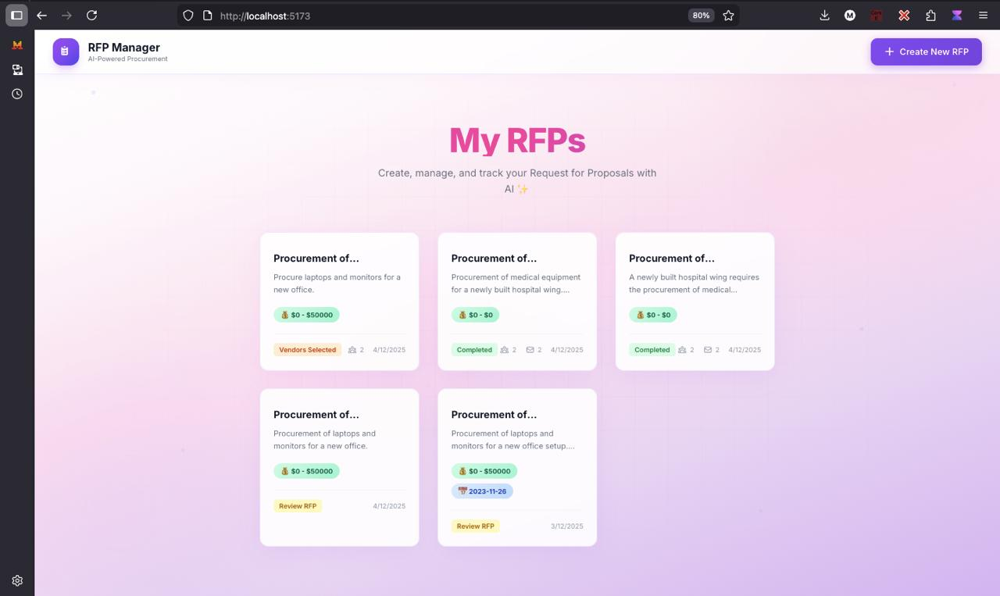
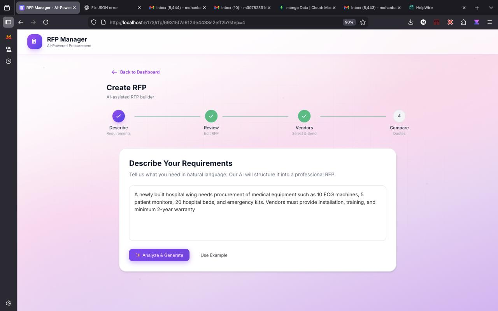
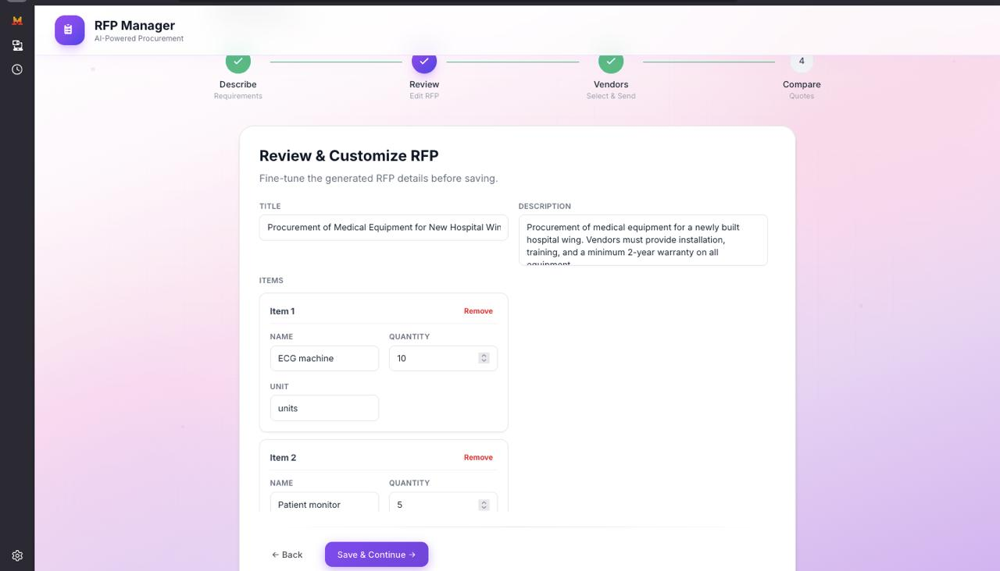

# 🎯 AI-Powered RFP Management System

> An intelligent, single-user web application that revolutionizes Request for Proposal (RFP) workflows through AI-powered automation, vendor management, and smart quote comparison.

<div align="center">


</div>

---

## 📋 Table of Contents

- [🚀 Quick Start](#-quick-start)
- [📸 Screenshots](#-screenshots)
- [✨ Features](#-features)
- [🛠️ Tech Stack](#-tech-stack)
- [📚 API Documentation](#-api-documentation)
- [🏗️ Project Structure](#-project-structure)
- [🎯 Decisions & Assumptions](#-decisions--assumptions)
- [🤖 AI Tools Usage](#-ai-tools-usage)

---

## 🚀 Quick Start

### Prerequisites

- **Node.js**: v18.0.0+
- **MongoDB**: v6.0+ (local or Atlas)
- **Google Gemini API Key**
- **Gmail Account** with App Password

### Installation

#### 1. Clone the Repository
```bash
git clone <repository-url>
cd "RFP Management System"
```

#### 2. Backend Setup
```bash
cd backend
npm install
```

Create `backend/.env`:
```env
PORT=5000
MONGODB_URI=mongodb://localhost:27017/rfp-management
GEMINI_API_KEY=your-gemini-api-key

# Email (SMTP)
EMAIL_HOST=smtp.gmail.com
EMAIL_PORT=587
EMAIL_USER=your-email@gmail.com
EMAIL_PASSWORD=your-gmail-app-password

# Email (IMAP)
IMAP_HOST=imap.gmail.com
IMAP_PORT=993
IMAP_USER=your-email@gmail.com
IMAP_PASSWORD=your-gmail-app-password
```

```bash
npm run dev    # http://localhost:5000
```

#### 3. Frontend Setup
```bash
cd ../frontend
npm install
```

Create `frontend/.env`:
```env
VITE_API_URL=http://localhost:5000/api
```

```bash
npm run dev    # http://localhost:5173
```

### Gmail App Password
1. Enable 2-Factor Authentication on Gmail
2. Go to: Google Account → Security → App passwords
3. Generate password for "Mail"
4. Use the 16-character password in `.env`

---

## 📸 Screenshots

### Dashboard

*RFP list with status badges and quick actions*

### Step 1: Describe

*Natural language input for AI to generate structured RFP*

### Step 2: Review

*Edit AI-generated RFP fields*

### Step 3: Vendors

*Select vendors and send RFP via email*

### Step 4: Compare

*AI-powered comparison with recommendations*

### Email Integration

*Professional HTML email sent to vendors*

---

## ✨ Features

| Step | Feature | Description |
|------|---------|-------------|
| **1** | **Describe** | Natural language input → AI generates structured RFP |
| **2** | **Review** | Edit AI-generated RFP fields (title, budget, items, criteria) |
| **3** | **Vendors** | Select vendors & send RFP via email |
| **4** | **Compare** | Fetch responses, AI compares quotes & recommends best vendor |

### AI Capabilities
- **Generate RFP**: Natural language → Structured JSON
- **Parse Emails**: Extract quote details from vendor responses
- **Compare & Recommend**: Best price, best warranty, best overall with scoring

---

## 🛠️ Tech Stack

| Layer | Technology |
|-------|------------|
| **Frontend** | React 18, Vite, Tailwind CSS, Framer Motion, Axios |
| **Backend** | Node.js, Express.js, MongoDB, Mongoose |
| **AI** | Google Gemini (gemini-2.5-flash → 1.5-flash → pro fallback) |
| **Email** | Nodemailer (SMTP), IMAP (receiving) |

---

## 📚 API Documentation


### RFP Endpoints

| Method | Endpoint | Description |
|--------|----------|-------------|
| `GET` | `/api/rfp` | Get all RFPs |
| `POST` | `/api/rfp` | Create new RFP |
| `GET` | `/api/rfp/:id` | Get single RFP |
| `DELETE` | `/api/rfp/:id` | Delete RFP |
| `POST` | `/api/rfp/generate-from-text` | AI: Generate RFP from text |
| `PUT` | `/api/rfp/:id/describe` | Save Step 1 data |
| `PUT` | `/api/rfp/:id/review` | Save Step 2 data |
| `POST` | `/api/rfp/:id/send-to-vendors` | Send RFP emails |
| `GET` | `/api/rfp/:id/emails/inbox` | Fetch inbox emails |
| `PUT` | `/api/rfp/:id/add-mail-response` | Add vendor response |
| `POST` | `/api/rfp/:id/compare-quotes` | AI: Compare quotes |

### Vendor Endpoints

| Method | Endpoint | Description |
|--------|----------|-------------|
| `GET` | `/api/vendors` | Get all vendors |


---

## 🏗️ Project Structure

```
RFP Management System/
├── backend/
│   ├── config/db.js              # MongoDB connection
│   ├── controllers/
│   │   ├── rfp.controller.js     # RFP business logic
│   │   └── vendor.controller.js  # Vendor CRUD
│   ├── helpers/
│   │   ├── email.helper.js       # SMTP/IMAP functions
│   │   └── gemini.helper.js      # AI integration
│   ├── models/
│   │   ├── RFP.js                # RFP schema
│   │   └── Vendor.js             # Vendor schema
│   ├── routes/
│   │   ├── rfp.routes.js
│   │   └── vendor.routes.js
│   ├── API_DOCUMENTATION.md
│   └── server.js
│
├── frontend/
│   ├── src/
│   │   ├── components/
│   │   │   ├── common/           # Button, Card, Modal, etc.
│   │   │   ├── rfp/              # RFP components
│   │   │   └── vendor/           # Vendor components
│   │   ├── pages/CreateRFP.jsx   # 4-step wizard
│   │   ├── services/api.js       # API client
│   │   ├── App.jsx
│   │   └── index.css
│   ├── vite.config.js
│   └── tailwind.config.js
│
├── screenshots/                   # Application screenshots
└── README.md
```

---

## 🏛️ Architecture

```
┌─────────────────────────────────────────────────────┐
│              FRONTEND (React + Vite)                │
│  4-Step Wizard: Describe → Review → Vendors → Compare│
└─────────────────────────────────────────────────────┘
                        ↕ REST API
┌─────────────────────────────────────────────────────┐
│              BACKEND (Express.js)                   │
│  Controllers → Helpers (AI, Email) → Models         │
└─────────────────────────────────────────────────────┘
        ↕                       ↕                ↕
┌──────────────┐    ┌──────────────┐    ┌──────────────┐
│   MongoDB    │    │  Gmail SMTP  │    │ Google Gemini│
│   Database   │    │  Gmail IMAP  │    │     API      │
└──────────────┘    └──────────────┘    └──────────────┘
```

---

## 🎯 Decisions & Assumptions

### Architecture Decisions

| Decision | Rationale |
|----------|-----------|
| **Flexible LLM Schema** | `llm_response` uses Mixed type to accept any AI output |
| **Model Fallback Chain** | gemini-2.5-flash → 1.5-flash → pro ensures reliability |
| **Email Reference Pattern** | `[REF: <rfp_id>]` in subject for response tracking |
| **Content Deduplication** | Hash-based comparison prevents duplicate responses |

### RFP Status Flow
```
New → Review RFP → Vendors Choosed → Vendors Responded → View Quotes → Completed
```

### Assumptions
- Single user system (no authentication)
- Gmail as primary email provider
- Vendors reply to same email thread
- English language for AI prompts

---

## 🤖 AI Tools Usage

### Tools Used in Development

| Tool | Purpose |
|------|---------|
| **GitHub Copilot** | Code completion, boilerplate |
| **Claude (Anthropic)** | Architecture, debugging, code review |
| **ChatGPT** | Prompt engineering for Gemini |

### Key AI Prompts

**RFP Generation:**
```
Convert natural language to structured RFP JSON.
CRITICAL: Only include fields with actual data from input.
Do not generate placeholder values.
```

**Quote Comparison:**
```
Compare vendor quotes for RFP requirements.
Return: best_price, best_warranty, best_overall with scores.
Include comparison_table with pros/cons.
```

### Learnings
- More specific prompts = better JSON output
- Always clean markdown/code blocks from AI response
- Multiple model fallback prevents failures

---

## 📄 License

ISC License

---

<div align="center">

**Built with ❤️ using AI-powered development**

</div>
